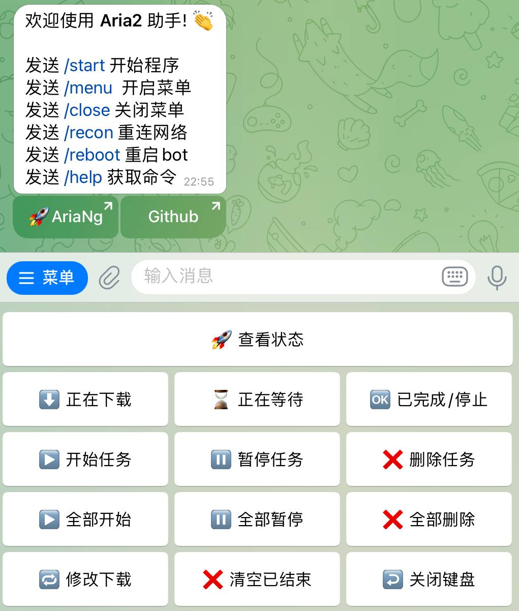

<h1 align="center">
  欢迎使用 Aria2 助手! 👏
</h1>

### Aria2 Telethon bot

1. 基于电报机器人控制Aria2
2. 支持 `批量` 添加 http、磁力、种子下载

### 如何安装

1.启动命令

```bash
docker run -dit \
  -e API_ID="xxxxxx" \
  -e API_HASH="xxxxxx" \
  -e BOT_TOKEN="xxxxxx" \
  -e USER_ID="xxxxxx" \
  -e RPC_URL="ws://127.0.0.1:6800/jsonrpc" \
  -e RPC_TOKEN="xxxxxx" \
  --name ariabot \
  --restart unless-stopped \
xuanpro/ariabot:latest
```

2.其它参数

使用代理(可选)

```bash
-e Proxy_Type = "xxxxxx"    # 代理类型, 支持http/socks5/MTProxy
-e Proxy_Addr = "xxxxxx"    # 代理地址
-e Proxy_Port = "xxxxxx"    # 代理端口
-e Proxy_User = "xxxxxx"    # 代理用户名（可选）
-e Proxy_Passwd = "xxxxxx"  # 代理密码（可选）
-e Proxy_Secret = "xxxxxx"  # 代理（socks5）
```

更新镜像

```bash
docker run --rm -v /var/run/docker.sock:/var/run/docker.sock containrrr/watchtower -cR ariabot
```

查看日志

```bash
docker logs -f ariabot
```

### 应用截图


